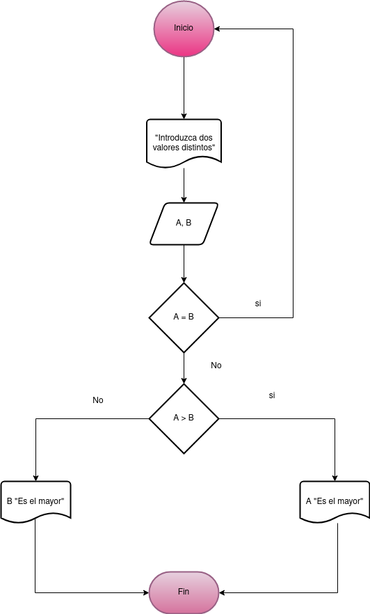
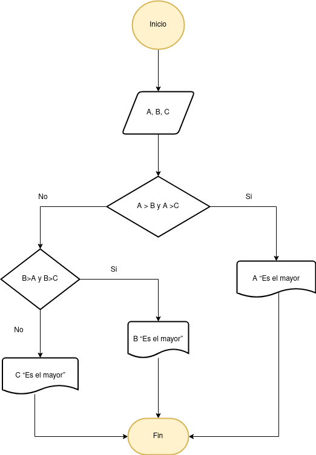

# Ejercicio 

- [Ejercicio 1](#ejercicio1)
- [Ejercicio 2](#ejercicio2)
- [Ejercicio 3](#ejercicio3)

## Ejercicio 1 

Desarrolle un algoritmo que permita leer dos valores distintos, determinar cual de los dos valores es el
mayor y escribirlo.

### Diagrama de Flujo
 

### Pseudocódigo

 - Inicio

 - Inicializar variables:   
 __A = 0, B = 0__

 - Solicitar la introducción de dos
valores distintos

 - Leer los dos valores

 - Asignarlos a las variables A y B

 - Si A = B Entonces vuelve a 3
porque los valores deben ser
distintos

 - Si A>B Entonces
Escribir A, __“Es el mayor”__

 - De lo contrario: Escribir B, __“Es
el mayor”__

 - Fin_Si

 - __Fin__

 ## Ejercicio 2 

 Desarrolle un algoritmo que permita leer tres valores y almacenarlos en las variables A, B y C
respectivamente. El algoritmo debe imprimir cual es el mayor y cual es el menor. Recuerde constatar que
los tres valores introducidos por el teclado sean valores distintos. Presente un mensaje de alerta en caso de
que se detecte la introducción de valores iguales.

### Diagrama de Flujo

 

### Pseudocódigo

 - Inicio
 - Inicializar las variables A, B y C
 - Leer los tres valores
 -  Almacenar en las variables A, B
y C
 - Si A > B y A > C Entonces
 - Escribir A __“Es el mayor”__
 - Sino
 - Si B > A y B > C Entonces
 - Escribir B __“Es el mayor”__
 - Sino
 - Escribir C __“Es el mayor”__
 - Fin_Si
 - Fin_Si
 - __Fin__

 ## Ejercicio 3 

 Desarrolle un algoritmo que realice la sumatoria de los números enteros comprendidos entre el 1 y el 10,
es decir, 1 + 2 + 3 + …. + 10.

### Diagrama de Flujo

 
